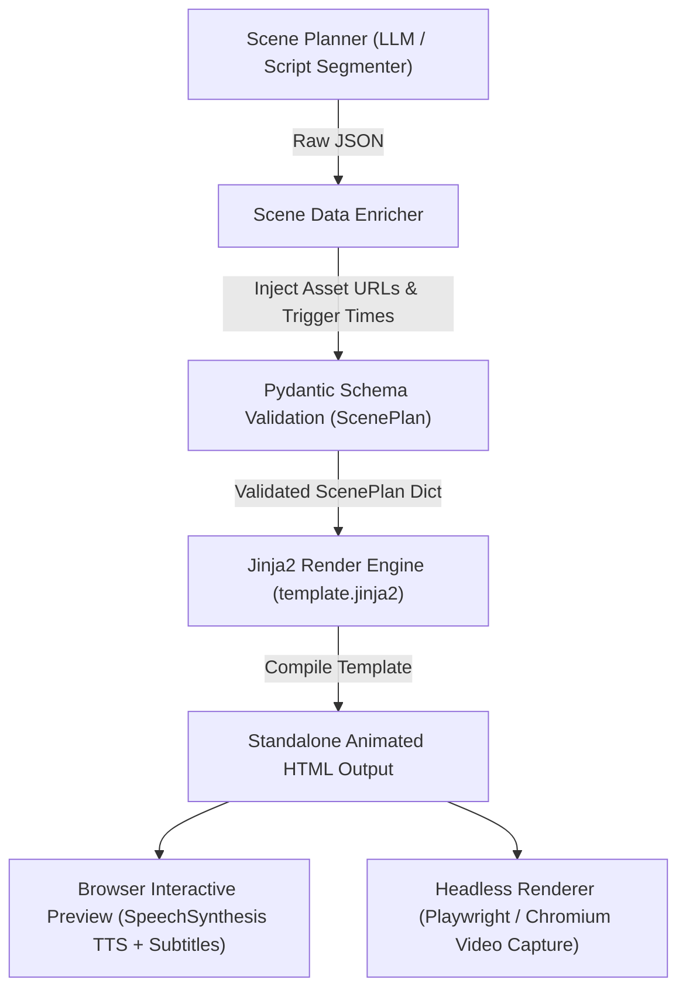

# Research Report: HTML-Based Scene Generation & Template System

**Author**: Osama  
**Project**: AI Video Generation Pipeline — Backend Render Component  
**Target Schema**: `backend/app/schemas/scene.py` (`ScenePlan`)  
**Date**: July 2026  

---

## 1. Executive Summary

This document presents a comprehensive technical research investigation into generating dynamic, animated HTML/CSS presentation scenes directly from **Scene Planner** JSON outputs (`ScenePlan` Pydantic schema). 

By leveraging **Jinja2 templating**, **HTML5/CSS3 vector graphics (SVG)**, and browser-native APIs (such as **Web Speech Synthesis API** for Text-to-Speech narration and subtitles), this rendering architecture provides an instant, interactive web-native explainer video experience without requiring heavy server-side video rendering compute.

---

## 2. Architecture Overview & Data Flow

The HTML scene rendering pipeline converts structured Scene Planner outputs into standalone, interactive HTML presentations.

### 2.1 Schema Mapping (`ScenePlan` -> Template Context)

The renderer ingests a validated `ScenePlan` data model:

- **`title`**: Injected into the browser `<title>`, header banners, and start overlay.
- **`scenes`**: Array of storyboard scenes. Each scene maps to a `.scene` container with unique `id="scene-{{ scene.scene_id }}"` and `data-layout-hint="{{ scene.layout_hint }}"`.
- **`scene.text`**: Spoken narration text passed to the client-side JavaScript engine.
- **`scene.subtitle`**: Caption text displayed dynamically in `#subtitle-bar`.
- **`scene.layout_hint`**: Selects modular visual layout blocks (`title-card`, `risk-diagram`, `tunnel-diagram`, `flow-diagram`, `cards`, `outro-checklist`).
- **`scene.visual_cues`**: List of `VisualCue` objects defining element types (`text`, `image`, `diagram`, `icon`, `svg`), asset URLs, target regions, and timing triggers.

---

## 3. Reusable Template System & Layout Engine

In coordination with the rendering architecture, `template.jinja2` provides a modular component system that categorizes scenes into visual layout patterns:

### 3.1 Supported Layout Hints

| Layout Hint | Description & Component Structure | Key Animations |
| :--- | :--- | :--- |
| `title-card` | Brand logo, primary topic title, animated vector cloud badge (🔒 VPN), "Let's Get Started" arrow. | `fadeUp` entry, `popIn` spring scaling |
| `risk-diagram` | End-user device facing open internet risks (Hacker, ISP, Watchers) connected by dashed trajectory paths. | `beamMove` particle motion along SVG `offset-path` |
| `tunnel-diagram` | Interactive 3D gradient tube with depth rings, glowing exit aperture, and traveling data packet with animated lock badge. | `packetTravel` motion along cubic bezier paths, `lockPop` badge scale |
| `flow-diagram` | Step-by-step node architecture (Device $\rightarrow$ VPN Server $\rightarrow$ Internet) with sequential lock & data transfers. | `lockTravel` path movement, step node pop-ins |
| `cards` | Multi-column benefit grid (Safer Wi-Fi, Privacy, Global Access) with custom vector icons. | `cardIn` staggered translateY transitions |
| `outro-checklist` | Summary bullet list with checkmarks and final gradient call-to-action badge. | Sequential list item slide-in & badge fade |

---

## 4. Technical Advantages (Pros)

1. **Lightweight Payload & Zero Compression Artifacts**:
   - Rendered HTML files are tiny (typically **30 KB to 50 KB**) compared to rendered MP4 video files (10 MB - 100 MB).
   - Vector SVG shapes and typography scale to crisp resolution across 1080p, 4K, or mobile screens without blurriness.

2. **Instant Interactive Preview**:
   - Users can preview, pause, restart, or scrub through scenes instantly in any modern web browser without waiting for server-side video encoding.

3. **Zero-Cost Local TTS Narration**:
   - Integrates browser-native **Web Speech Synthesis API** (`SpeechSynthesisUtterance`), allowing audio narration without incurring API costs for draft previews.

4. **Declarative CSS & Hardware Acceleration**:
   - Utilizes CSS GPU acceleration (`transform`, `opacity`, `offset-path`), delivering smooth 60 FPS transitions without heavy CPU utilization.

5. **Flexible Data & Asset Swapping**:
   - Template placeholders allow instant swapping of asset URLs, brand logos, or color themes by re-rendering Jinja2 templates in milliseconds.

---

## 5. Technical Cons & Limitations

1. **Headless Audio Recording Complexity**:
   - *Issue*: Standard Playwright / Puppeteer headless Chrome instances do not pass Web Speech API audio or web audio out-of-the-box when saving screen recordings.
   - *Impact*: Converting the interactive HTML file into a downloadable MP4 video requires setting up virtual audio loopback drivers or injecting pre-rendered MP3 audio files.

2. **OS & Browser Speech Voice Discrepancies**:
   - *Issue*: Web Speech Synthesis relies on native OS voices (e.g. Microsoft Zira on Windows, Apple Samantha on macOS, Google US English on ChromeOS).
   - *Impact*: Narration voice timbre, pitch, speed, and pronunciation vary across operating systems.

3. **Non-Deterministic Animation Timing During Video Encoding**:
   - *Issue*: CSS `@keyframes` and `setTimeout`/`setInterval` run relative to real-time wall-clock time. If server CPU load spikes during Playwright frame capture, frames may drop or desynchronize.

4. **External Asset CORS & Font Dependencies**:
   - *Issue*: Custom fonts, external images, or remote SVGs require reliable network access or base64 data URI inline bundling to ensure offline preview compatibility.

---

## 6. Production Recommendations & Best Practices

To transition this HTML scene renderer into a full video compilation pipeline:

1. **Audio Integration**: Replace Web Speech API with server-generated TTS audio files (e.g. Edge-TTS, ElevenLabs, or Google Cloud TTS). Pass audio URLs in `ScenePlan` and sync scene timing to precise audio durations (`audio.duration`).
2. **Deterministic Time-Stepping for Playwright Video Capture**: Expose a global JS function (e.g. `window.seekToTime(seconds)`) in the template. Playwright can freeze real-time CSS animations and step frame-by-frame (`seekToTime(0.033 * frame)`) for deterministic, lossless 60 FPS MP4 video rendering via FFmpeg.

---

## 7. Conclusion

The implemented Jinja2 HTML rendering system (`template.jinja2` + `render_demo.py` + `dummy_scene_plan.json`) successfully fulfills the requirements of HTML-based scene generation. It provides a modular, highly performant foundation for web previewing and production video recording.
